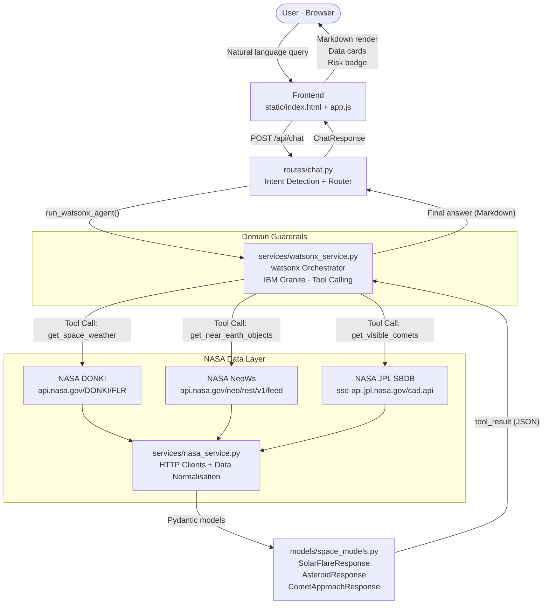

# ASTRA — Space Situational Intelligence

<div align="center">


**Transforming raw NASA telemetry into clear, human-readable space situational intelligence.**

[Live Demo](#getting-started) · [Architecture](#architecture) · [API Reference](#api-reference) · [How IBM Bob Was Used](#how-ibm-bob-was-used)

</div>

---

## Selected Challenge Theme

> **Advance Space Exploration with AI**

Space generates an overwhelming volume of raw, technical data every second. ASTRA's mission aligns directly with this challenge theme: transform space exploration from a data-heavy discipline accessible only to specialists into an insight-driven experience that anyone can engage with — students, educators, amateur astronomers, and the general public alike.

---

## Problem Statement

NASA's public APIs — **NeoWs** (asteroid close approaches), **DONKI** (space weather events), and **JPL SBDB** (comet orbital data) — deliver scientifically precise JSON payloads that are intentionally exhaustive. A single NeoWs response for a 7-day window can return dozens of nested objects per asteroid, each carrying raw orbital mechanics in multiple unit systems. A DONKI response uses NOAA region numbers, ISO timestamps, and flare-class notation (A–X scale) without any contextual explanation.

This creates a hard accessibility wall:

| Audience | Barrier |
|---|---|
| General public | Incomprehensible jargon, no narrative context |
| Students | Unable to distinguish signal from noise in raw JSON |
| Educators | No out-of-the-box shareable summaries |
| Enthusiasts | Must cross-reference multiple technical documents |

The gap between **raw planetary-science data** and **actionable human understanding** is the problem ASTRA solves.

---

## Solution Description

**ASTRA (Automated Space Tracking and Reconnaissance Assistant)** is an AI-powered Space Situational Intelligence web platform built on top of a FastAPI backend and IBM watsonx.ai.

Users type a natural language question — *"Which asteroids are passing close to Earth this week?"* — and ASTRA:

1. **Classifies the intent** using a lightweight keyword heuristic in [`routes/chat.py`](routes/chat.py).
2. **Routes the query to IBM watsonx.ai** (IBM Granite model) with a structured system prompt and three registered tools.
3. **Executes a deterministic Tool Call** against the appropriate NASA endpoint — no hallucinated data, only ground-truth API responses.
4. **Feeds the verified JSON payload back** to the model so it can synthesise a concise, human-readable answer in the user's language.
5. **Renders the response** with full Markdown support and a data card grid in the dark-mode scientific UI.

Zero hallucinations. Every fact in the final answer is traceable to a live NASA API call.

---

## Architecture

### Component Diagram



### Module Responsibilities

| Module | Responsibility |
|---|---|
| [`astra_server.py`](astra_server.py) | FastAPI application entry point; mounts routers and static files |
| [`config.py`](config.py) | Env loading, HTTP timeouts (`NASA_HTTP_TIMEOUT`, `WATSONX_TIMEOUT_SECONDS`), logger |
| [`routes/chat.py`](routes/chat.py) | `POST /api/chat` — keyword-based intent detection, watsonx delegation |
| [`routes/space_data.py`](routes/space_data.py) | Direct REST endpoints (`/api/space-weather/solar-flares`, `/api/asteroids/close-approaches`, `/api/comets/close-approaches`) |
| [`services/watsonx_service.py`](services/watsonx_service.py) | Watsonx model initialisation, tool schemas, system prompt, agent loop |
| [`services/nasa_service.py`](services/nasa_service.py) | Async HTTP clients for DONKI / NeoWs / JPL SBDB; data normalisation |
| [`models/schemas.py`](models/schemas.py) | `ChatRequest`, `ChatResponse`, `Intent`, `SpaceDomain` Pydantic models |
| [`models/space_models.py`](models/space_models.py) | `SolarFlareResponse`, `AsteroidResponse`, `CometApproachResponse` Pydantic models |
| [`static/`](static/) | Vanilla HTML + Tailwind CSS + DOMPurify + marked.js frontend |

---

## AI Approach

### Orchestrator — IBM watsonx.ai with Domain Guardrails

The model ([`ibm/granite-4-h-small`](services/watsonx_service.py:249) by default, configurable via `WATSONX_MODEL_ID`) is initialised in [`services/watsonx_service.py`](services/watsonx_service.py) and governed by a hierarchical system prompt that enforces **strict domain boundaries**:

- **Allowed:** space weather, near-Earth objects, comets, NASA missions, astrophysics, orbital mechanics, space exploration.
- **Blocked (mandatory refusal):** any out-of-scope topic (politics, recipes, coding help unrelated to space, etc.). The model is instructed to decline politely, explain its specialisation, and suggest a space-related question.

This guardrail is enforced at the **highest-priority section** of the [`AGENT_SYSTEM_PROMPT`](services/watsonx_service.py:104) — it overrides all other instructions on every turn.

### Tool Calling — Deterministic Ground Truth

The agent is equipped with three OpenAI-compatible function schemas:

#### `get_space_weather`
- **Source:** NASA DONKI (`api.nasa.gov/DONKI/FLR`)
- **Data:** Observed solar flare classifications (A–X scale), begin/peak/end times, active region numbers, source locations.
- **Constraint:** Past observations only (`days` 1–30). The model is explicitly prohibited from presenting historical flares as forecasts.

#### `get_near_earth_objects`
- **Source:** NASA NeoWs / CNEOS (`api.nasa.gov/neo/rest/v1/feed`)
- **Data:** Upcoming asteroid close approaches — miss distance (km + AU), relative velocity (km/s), estimated diameter range (m), potentially-hazardous classification.
- **Constraint:** Maximum 7-day window (NeoWs hard API limit). `days` clamped to 1–7.

#### `get_visible_comets`
- **Source:** NASA/JPL Small-Body Database CAD API (`ssd-api.jpl.nasa.gov/cad.api`)
- **Data:** Upcoming comet close-approach events — designation, date, miss distance (AU), relative velocity, absolute magnitude H.
- **Constraint:** `days` 1–30, `max_distance_au` up to 1.3 AU.

### Agent Execution Loop

```
User message
    │
    ▼
[Turn 1] system + user → watsonx → tool_call{name, arguments}
    │
    ▼
Dispatch to nasa_service → fetch & normalise → Pydantic model → JSON
    │
    ▼
[Turn 2] + tool result → watsonx → final Markdown answer
    │
    ▼
ChatResponse → Frontend
```

Implemented in [`run_watsonx_agent()`](services/watsonx_service.py:287). The model cannot fabricate data because it receives real API output in the tool-result message before generating the final answer.

### Frontend — Scientific Dark UI

- **Markdown rendering:** [`marked.js`](static/index.html:13) + [`DOMPurify`](static/index.html:14) — sanitised HTML rendered directly into `#result-answer`.
- **Risk badge:** Dynamic badge mapped from the DONKI flare-class scale (A/B → Low, C → Moderate, M → High, X → Critical) and from PHA counts in the NeoWs response.
- **Data cards:** [`buildResultViewModel()`](static/js/app.js:214) builds a 4-card scientific metrics grid per tool — period queried, event count, strongest class / hazardous count, data source.
- **Intent-aware processing steps:** Animated step display shows `"Analyzing natural language..."` → `"Sending query to the ASTRA API..."` while the request is in flight.
- **Design system:** Tailwind CSS with a custom `space-{950,900,800,700}` + `astra-{400,500}` + `cosmic-{400,500,600,900}` palette; `Inter` + `JetBrains Mono` typography.

---

## How IBM Bob Was Used

IBM Bob served as the **primary development partner and architecture co-pilot** throughout the entire lifecycle of ASTRA. Its contributions were concrete and directly traceable in the committed codebase:

### 1. Monolithic Refactoring & Module Architecture

The original ASTRA backend was a **600+ line monolithic Python file** containing route handlers, NASA API HTTP calls, watsonx integration, Pydantic model definitions, and configuration all mixed together. Bob analysed the file, identified natural separation points, and guided the refactor into the clean layered structure visible today:

```
Before (monolith)          After (modular)
──────────────────         ──────────────────────────────────
astra_server.py            astra_server.py       ← entry point only
(600+ lines, mixed         config.py             ← env, timeouts, logger
 concerns)                 routes/
                               chat.py           ← /api/chat + intent
                               space_data.py     ← direct data endpoints
                           services/
                               nasa_service.py   ← all NASA HTTP clients
                               watsonx_service.py← agent + tools + prompt
                           models/
                               schemas.py        ← chat I/O models
                               space_models.py   ← space data models
```

Each module now has a single, clearly stated responsibility (see the docstring on line 1 of each file). Bob enforced the principle that `astra_server.py` should contain nothing except the FastAPI app, router mounts, and the static-file catch-all.

### 2. Pydantic Data Layer Design

Bob designed the complete Pydantic model hierarchy in [`models/space_models.py`](models/space_models.py) and [`models/schemas.py`](models/schemas.py) — typed event models (`SolarFlareEvent`, `CometApproachEvent`, `AsteroidCloseApproach`) and their aggregate response wrappers — replacing raw dictionary passing across layers with validated, serialisable data contracts.

### 3. NASA Service Layer Implementation

Bob implemented the async NASA HTTP clients in [`services/nasa_service.py`](services/nasa_service.py), including:
- Graceful `DEMO_KEY` fallback when `NASA_API_KEY` is not set.
- `compact_flares()`, `compact_comet_approaches()`, `compact_asteroids()` — normalisation functions that flatten and sort raw NASA payloads into clean event lists.
- `flare_strength()` — a typed comparator enabling correct `max()` over the A–X flare class scale.
- Differentiated HTTP error handling: `503` for timeouts, `502` for API or format errors, with clear `detail` strings that surface in the frontend.

### 4. Watsonx Agent & Guardrail Prompt Engineering

Bob structured the three OpenAI-compatible tool schemas (`SPACE_WEATHER_TOOL`, `COMET_TOOL`, `NEO_TOOL`) and authored the hierarchical [`AGENT_SYSTEM_PROMPT`](services/watsonx_service.py:104) with an explicit priority ordering:

1. **Domain Guardrails** (highest priority — mandatory refusal for out-of-scope queries)
2. **Language rule** (respond in the user's language)
3. **Per-tool constraints** (temporal direction, `days` range, unit reporting, disclaimer clauses)
4. **General response guidelines** (factual, cited, no speculation)

Bob also implemented the defensive argument-parsing block in [`run_watsonx_agent()`](services/watsonx_service.py:309) that handles Granite's occasional double-encoded JSON arguments and clamps `days` to valid ranges before dispatching the tool call.

### 5. Frontend Markdown Rendering & Dark UI System

Bob implemented the full Markdown-to-HTML rendering pipeline in the frontend:
- Integration of `marked.js` and `DOMPurify` with a scoped CSS rule set targeting `#result-answer` descendants.
- Dark-theme typography rules for headings, paragraphs, lists, inline code, code blocks, blockquotes, and links — all inside [`static/index.html`](static/index.html:38).
- The `buildResultViewModel()` function in [`static/js/app.js`](static/js/app.js:214) that branches on `tool_used` to build domain-specific data cards.
- The risk-level badge system mapping flare classes and PHA counts to colour-coded UI states.

### 6. Error Handling & Reliability

Bob added the global unhandled exception handler in [`astra_server.py`](astra_server.py:21) that guarantees JSON error responses even for unexpected crashes — preventing the frontend from receiving plain-text 500 pages that break `response.json()`. Bob also implemented the frontend's raw-body parse guard in [`app.js`](static/js/app.js:186) for the same defensive reason.

---

## Getting Started

### Prerequisites

- Python **3.11+**
- An [IBM Cloud API Key](https://cloud.ibm.com/iam/apikeys) with access to **IBM watsonx.ai**
- A watsonx.ai **Project ID** with an associated Watson Machine Learning instance
- *(Optional)* A [NASA API Key](https://api.nasa.gov/) — the app falls back to `DEMO_KEY` automatically

### Installation

```bash
# 1. Clone the repository
git clone https://github.com/alessgii/astra-space-situational-intelligence.git
cd astra-space-situational-intelligence

# 2. Create and activate a virtual environment
python -m venv venv
source venv/bin/activate          # Linux / macOS
# venv\Scripts\activate           # Windows

# 3. Install dependencies
pip install -r requirements.txt
```

### Configuration

Copy `.env.example` to `.env` and fill in your credentials:

```bash
cp .env.example .env
```

```dotenv
IBM_CLOUD_API_KEY="your-ibm-cloud-api-key"
WATSONX_PROJECT_ID="your-watsonx-project-id"
WATSONX_URL="https://us-south.ml.cloud.ibm.com"   # or your region
WATSONX_MODEL_ID="ibm/granite-4-h-small"           # default; override as needed
NASA_API_KEY="your-nasa-api-key"                   # optional — falls back to DEMO_KEY
```

> **Note:** If watsonx credentials are absent, the server still starts and the API health endpoint responds, but `/api/chat` will return a `"configure_watsonx_credentials"` prompt instead of an answer.

### Run

```bash
uvicorn astra_server:app --reload
```

The application will be available at [http://localhost:8000](http://localhost:8000).

---

## API Reference

| Method | Endpoint | Description |
|---|---|---|
| `GET` | `/api/health` | Health check — returns `{"status": "ok"}` |
| `POST` | `/api/chat` | Main chat endpoint. Body: `{"message": "...", "location": null}` |
| `GET` | `/api/space-weather/solar-flares` | Direct DONKI solar flares. Query: `?days=3` (1–30) |
| `GET` | `/api/asteroids/close-approaches` | Direct NeoWs asteroid feed. Query: `?days=7` (1–7) |
| `GET` | `/api/comets/close-approaches` | Direct JPL SBDB comet approaches. Query: `?days=14&max_distance_au=0.5` |

Interactive API documentation is available at [http://localhost:8000/docs](http://localhost:8000/docs) (Swagger UI) once the server is running.

---

## Data Sources

| Source | API | Coverage |
|---|---|---|
| **NASA DONKI** | `api.nasa.gov/DONKI/FLR` | Solar flare classifications (A–X), active region data, real-time space weather alerts |
| **NASA NeoWs / CNEOS** | `api.nasa.gov/neo/rest/v1/feed` | Asteroid close-approach data, miss distances, velocity, hazard classification |
| **NASA/JPL SBDB CAD** | `ssd-api.jpl.nasa.gov/cad.api` | Comet and minor-planet close-approach events, orbital parameters |

---

## Project Structure

```
astra-space-situational-intelligence/
├── astra_server.py          # FastAPI app, router mounts, global error handler
├── config.py                # Env loading, constants, HTTP timeouts, logger
├── requirements.txt         # Python dependencies
├── .env.example             # Credential template
├── systemprompt.txt         # Legacy prompt reference
├── routes/
│   ├── chat.py              # POST /api/chat — intent detection + watsonx delegation
│   └── space_data.py        # Direct space data REST endpoints
├── services/
│   ├── nasa_service.py      # Async NASA HTTP clients + data normalisation
│   └── watsonx_service.py   # watsonx model, tool schemas, system prompt, agent loop
├── models/
│   ├── schemas.py           # Chat I/O Pydantic models
│   └── space_models.py      # Space event Pydantic models
└── static/
    ├── index.html           # Single-page frontend (Tailwind + marked.js)
    ├── favicon.svg          # ASTRA logo
    ├── css/
    │   └── custom.css       # Custom CSS animations and utilities
    └── js/
        └── app.js           # Frontend logic — query, rendering, risk classification
```

---

## License

This project is licensed under the **MIT License**.

---

*Built for the IBM AI Challenge 2026 · Powered by IBM watsonx.ai and NASA Open APIs*
